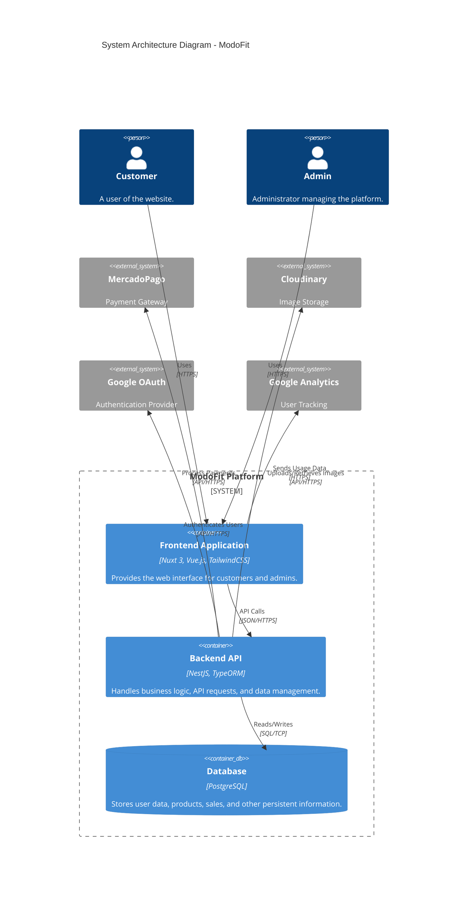

```mermaid
C4Context
    title System Architecture Diagram - ModoFit

    Person(customer, "Customer", "A user of the website.")
    Person(admin, "Admin", "Administrator managing the platform.")

    System_Boundary(modofit, "ModoFit Platform") {
        Container(frontend, "Frontend Application", "Nuxt 3, Vue.js, TailwindCSS", "Provides the web interface for customers and admins.")
        Container(backend, "Backend API", "NestJS, TypeORM", "Handles business logic, API requests, and data management.")
        ContainerDb(database, "Database", "PostgreSQL", "Stores user data, products, sales, and other persistent information.")
    }

    System_Ext(mercadopago, "MercadoPago", "Payment Gateway")
    System_Ext(cloudinary, "Cloudinary", "Image Storage")
    System_Ext(google_oauth, "Google OAuth", "Authentication Provider")
    System_Ext(google_analytics, "Google Analytics", "User Tracking")

    Rel(customer, frontend, "Uses", "HTTPS")
    Rel(admin, frontend, "Uses", "HTTPS")

    Rel(frontend, backend, "API Calls", "JSON/HTTPS")
    Rel(backend, database, "Reads/Writes", "SQL/TCP")

    Rel(backend, mercadopago, "Process Payments", "API/HTTPS")
    Rel(backend, cloudinary, "Uploads/Retrieves Images", "API/HTTPS")
    Rel(backend, google_oauth, "Authenticates Users", "API/HTTPS")
    
    Rel(frontend, google_analytics, "Sends Usage Data", "HTTPS")
```
