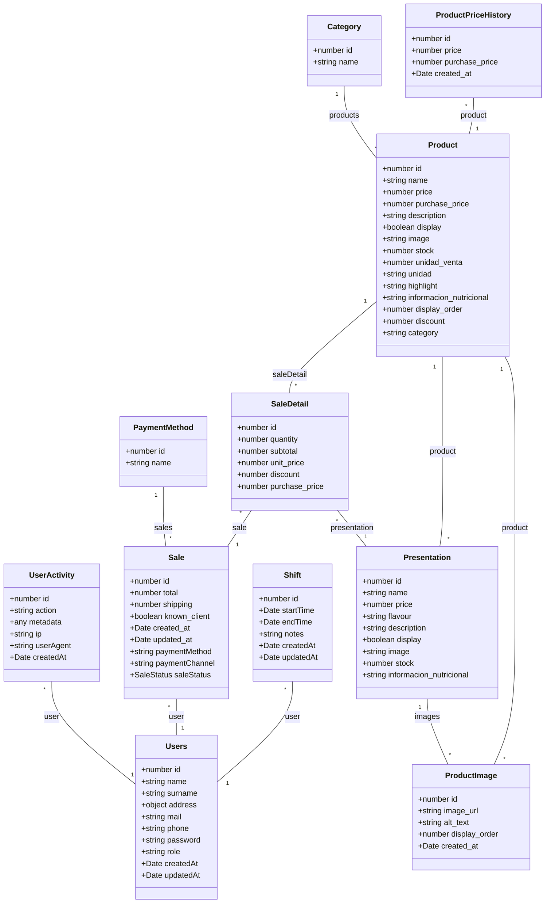

```mermaid
classDiagram
    class UserActivity {
        +number id
        +string action
        +any metadata
        +string ip
        +string userAgent
        +Date createdAt
    }
    class Category {
        +number id
        +string name
    }
    class Presentation {
        +number id
        +string name
        +number price
        +string flavour
        +string description
        +boolean display
        +string image
        +number stock
        +string informacion_nutricional
    }
    class ProductImage {
        +number id
        +string image_url
        +string alt_text
        +number display_order
        +Date created_at
    }
    class ProductPriceHistory {
        +number id
        +number price
        +number purchase_price
        +Date created_at
    }
    class Product {
        +number id
        +string name
        +number price
        +number purchase_price
        +string description
        +boolean display
        +string image
        +number stock
        +number unidad_venta
        +string unidad
        +string highlight
        +string informacion_nutricional
        +number display_order
        +number discount
        +string category
    }
    class PaymentMethod {
        +number id
        +string name
    }
    class SaleDetail {
        +number id
        +number quantity
        +number subtotal
        +number unit_price
        +number discount
        +number purchase_price
    }
    class Sale {
        +number id
        +number total
        +number shipping
        +boolean known_client
        +Date created_at
        +Date updated_at
        +string paymentMethod
        +string paymentChannel
        +SaleStatus saleStatus
    }
    class Shift {
        +number id
        +Date startTime
        +Date endTime
        +string notes
        +Date createdAt
        +Date updatedAt
    }
    class Users {
        +number id
        +string name
        +string surname
        +object address
        +string mail
        +string phone
        +string password
        +string role
        +Date createdAt
        +Date updatedAt
    }

    UserActivity "*" -- "1" Users : user
    Category "1" -- "*" Product : products
    Presentation "*" -- "1" Product : product
    Presentation "1" -- "*" ProductImage : images
    ProductImage "*" -- "1" Product : product
    ProductPriceHistory "*" -- "1" Product : product
    Product "1" -- "*" SaleDetail : saleDetail
    PaymentMethod "1" -- "*" Sale : sales
    SaleDetail "*" -- "1" Sale : sale
    SaleDetail "*" -- "1" Presentation : presentation
    Sale "*" -- "1" Users : user
    Shift "*" -- "1" Users : user
```
